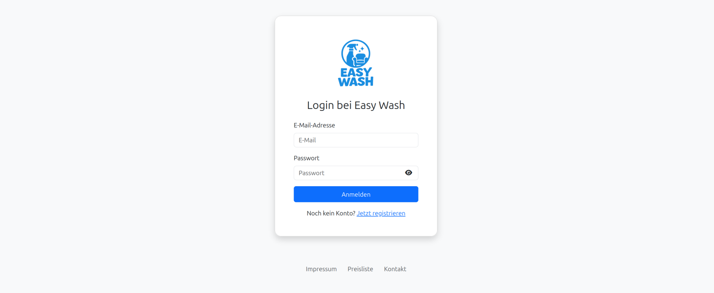
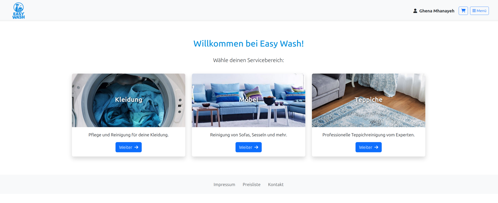
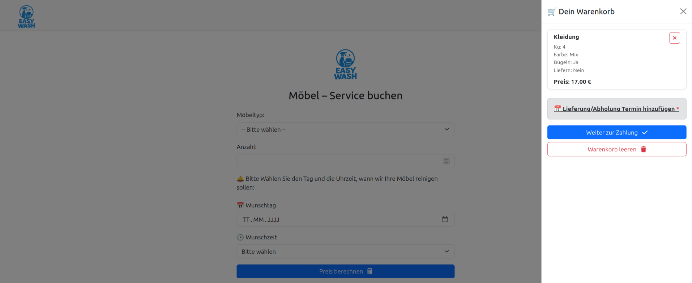

# 👋 Hallo, ich bin Ghena

Willkommen in meinem Portfolio!  
Hier finden Sie eine Übersicht über mich, meine Projekte sowie die Kenntnisse, die ich bisher erworben habe.

---

## Über mich

Ich bin **Wirtschaftsinformatik-Studentin** mit großer Leidenschaft für Programmierung und Softwareentwicklung.  
In diesem Repository präsentiere ich kleine Projekte, die während meiner Lernreise entstanden sind.  

Mein Ziel ist es, durch eigene kleine Projekte mit unterschiedlichen Technologien meine bereits gewonnenen Kenntnisse zu vertiefen und mir damit einen erfolgreichen Berufseinstieg zu ermöglichen.  
Derzeit lerne ich selbstständig den Umgang mit der **React-Bibliothek**, da sie in der modernen Webentwicklung weit verbreitet ist.  

---

## Projekte

### EasyWash: Reinigungs-Service (Gruppenarbeit im Studium)
- **Beschreibung:**  
  Entwicklung einer Webanwendung für ein Reinigungsunternehmen mit dem Ziel, Arbeitsprozesse zu digitalisieren.  
  Funktionen:  
  - Registrierung & E-Mail-Verifizierung  
  - Login  
  - Warenkorb & Preisberechnung  
  - Terminbuchung  
  - Bestellabschluss inkl. PDF & QR-Code  
  - Admin-Dashboard (z. B. Bestellungen verwalten, Benutzer sperren/entsperren)  

  *(Das Projekt wurde in kurzer Zeit als Modulabschlussarbeit entwickelt und bewusst einfach gehalten.)*
  
📸 **Screenshots:**  

- **Tech-Stack:** PHP, MySQL, Smarty, Bootstrap, HTML, CSS  
- [Code ansehen](https://github.com/Ghena-Mhanayeh/Mein-Portfolio)  
- [Live-Demo](https://mein-portfolio-production.up.railway.app/)  

---

## Skills

**Frontend:**      
**Backend:**    
**Sprachen:**    
**Tools:** Git, Bootstrap  

---

## Kontakt
- [💼 LinkedIn-Profil](https://www.linkedin.com/in/ghena-mhanayeh-8a551b324)  
- [📧 E-Mail](mailto:Ghenamhnayeh@gmail.com)  

Ich freue mich über Austausch und neue Möglichkeiten im Bereich Softwareentwicklung.  

⭐️ Vielen Dank fürs Vorbeischauen!
